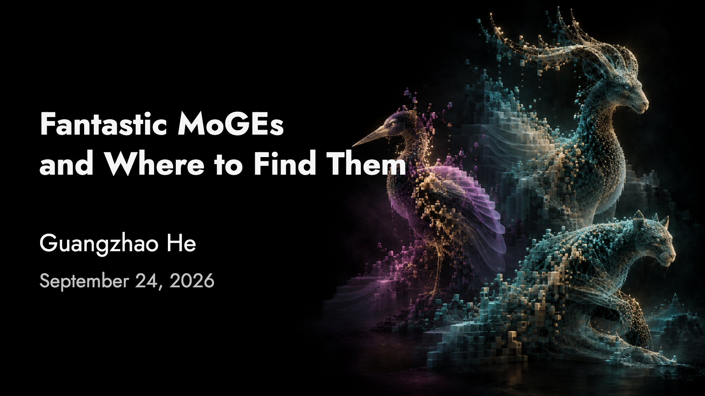

# JostSlides

JostSlides is a local-first presentation framework for research talks. Decks are written in Python, rendered as offline HTML, and presented through a browser interface with speaker notes, an audience window, videos, interactive scientific scenes, and optional Remotion animation.



This public repository includes one complete example: **Fantastic MoGEs and Where to Find Them**, a 34-slide research presentation covering MoGe 1, MoGe 2, and MoGe 3. Its figures, videos, papers, interactive scenes, and provenance records are bundled under [`decks/2026-09-24`](decks/2026-09-24).

## Quick start

HTML builds and the local server require Python 3.10 or newer. Install the optional dependencies for layout checks, browser tests, and PDF/PPTX export.

```bash
git clone https://github.com/guangzhaohe/JostSlides.git
cd JostSlides
python3 -m venv .venv
source .venv/bin/activate
python -m pip install -r requirements.txt
python -m playwright install chromium
python slides.py check
python slides.py serve
```

Open <http://localhost:8769>. The server binds to localhost and does not upload the presentation.

## What the framework provides

- A fixed 1152 × 648 authoring canvas with bundled Jost fonts
- Portable offline HTML with embedded images, fonts, notes, and runtime code
- Local video and soundtrack playback with an all-or-nothing startup gate
- Browser-local speaker notes keyed by stable deck and slide IDs
- A synchronized audience window without presenter notes
- Overview, fullscreen, source context, and keyboard navigation
- Canvas-based scientific scenes and evidence widgets
- Optional Remotion transitions that start when a slide enters
- PDF and editable PPTX export, including video posters and embedded movies
- Validation for IDs, assets, readable text sizes, and canvas bounds

## Common commands

```bash
python slides.py list
python slides.py check
python slides.py build
python slides.py serve
python slides.py export
python slides.py new YYYY-MM-DD --title "Talk title"
```

Generated files go to `build/<date>/`; the active local preview is written to the ignored root `index.html`. Do not edit generated files directly.

## Where to make changes

| Path | Purpose |
| --- | --- |
| `decks/<date>/deck.py` | Slide content, order, notes, and sources |
| `decks/<date>/media/` | Images, videos, and audio required by the deck |
| `decks/<date>/evidence/` | Frozen data used by interactive scenes or results |
| `decks/<date>/references/` | Source papers and provenance records |
| `app/` | Presenter UI, startup gate, video/audio, scenes, and motion runtime |
| `slidekit/` | Deck loading, validation, building, serving, and export |
| `templates/` | New-deck scaffold |
| `tests/` | Public framework and deck regression tests |

Read [Authoring](docs/AUTHORING.md) for the slide schema and editing workflow, [Architecture](docs/ARCHITECTURE.md) for the runtime design, and the [MoGe deck guide](decks/2026-09-24/README.md) for the included presentation.

## Presenting

- **Right Arrow** or **Space**: next slide
- **Left Arrow**: previous slide
- **G**: overview
- **F**: fullscreen
- **N**: toggle speaker notes
- **?**: keyboard shortcuts

Notes are stored in the browser profile for the current origin. Use **Export all notes** before clearing browser data or changing machines.

The startup gate waits for every required font, image, video, audio file, and runtime asset before revealing either presenter or audience view. If an asset fails, the gate remains closed and offers a retry.

## Validation

```bash
python -m unittest discover -s tests -p 'test_*.py'
```

The tests validate the public deck, offline presentation startup, interaction, notes, bundled assets, and the normalized-shift teaching scene.

## Public scope and provenance

Only the September 24 MoGe presentation is included. No other private decks, evidence, notes, generated builds, or Git history are part of this repository.

The framework bundles third-party font and runtime license notices under `app/fonts/` and `app/motion/licenses/`. Research-paper figures, videos, and PDFs retain their original authorship; [`references/SOURCES.md`](decks/2026-09-24/references/SOURCES.md) records each source and local transformation.
