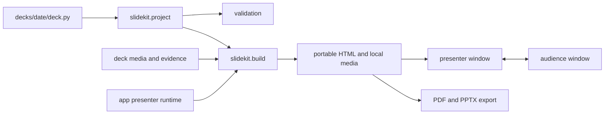

# Framework architecture

JostSlides separates authored research content from the presenter and build system.

## Deck loading and validation

`slidekit.project` imports one dated `deck.py`, validates metadata and slide IDs, verifies asset paths stay inside the deck folder, and checks supported scenes, videos, and builds. The stricter `slides.py check` pass also verifies text size and text-box width using the bundled font.

## Build output

`slidekit.build` combines the deck data with `app/template.html` in one pass. Fonts, images, SVGs, runtime code, notes, and evidence JSON are embedded. Videos and soundtracks are copied beside the output so the browser can preload them without network access.

The root `index.html` preserves a stable localhost origin for browser notes. `build/<date>/index.html` is the portable deck-specific output. Both are generated and ignored by Git.

## Startup contract

`app/startup.js` inventories the complete deck before presentation. It loads fonts, images, videos, soundtracks, and the motion runtime, then opens the gate only when every required asset is ready. A failure keeps the full-screen gate visible and exposes a retry action.

This contract prevents late media downloads, layout shifts, and presenter/audience divergence during a talk.

## Presentation state

`app/presenter.js` owns the current slide, build step, notes, focus state, widget state, motion state, and video state. The audience window receives the shared presentation state through `postMessage`; speaker notes and editing controls remain private to the presenter.

Notes are stored in browser local storage under the stable `META['id']` and slide ID. Removed slides remain present in exported note backups.

## Media and interaction

- `app/video.js` preloads local videos, preserves playback state, and keeps the audience muted
- `app/audio.js` handles slide-scoped soundtracks and continuous transitions
- `app/scenes.js` renders offline scientific visualizations on canvas
- `app/widgets.js` renders evidence-driven controls from frozen JSON
- `app/motion/runtime.js` is the compiled Remotion bundle used without a Node server

## Export

`slidekit.export` captures interactive scenes, renders slides, and writes PDF and PPTX artifacts. The PPTX remains editable for text and shapes; videos are embedded when present.
